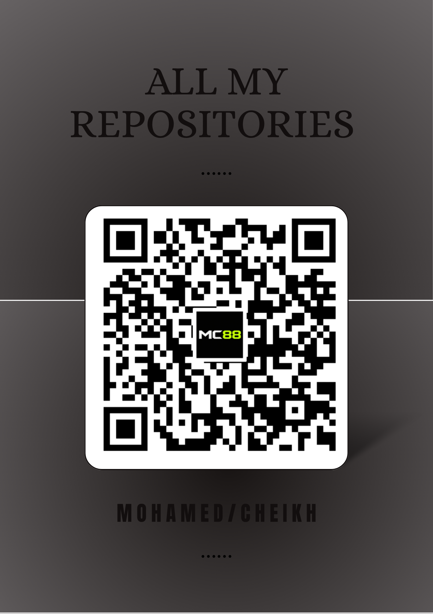

# MC88 — Mohamed ould Cheikh

**Computer Science student · Mauritania 🇲🇷**

*I build small, honest software — mostly for the web, mostly for the people around me.*

---

## 👋 Welcome

I'm Mohamed — known online as **MC88**.

I study Computer Science in Mauritania, and in the time between classes and coursework, I build things for the web. Small things, mostly. A pharmacy interface. A restaurant menu. A clock that follows the sun. Tools to generate data, sign a PDF, scan a QR code, remember a word. Nothing that claims to change the world — just software I wanted to exist, so I made it.

Most of what you'll find here runs entirely **inside your browser**. No accounts, no servers quietly collecting things, no reason to trust me beyond what you can see. Your files stay on your device. Your settings stay on your device. That's not a marketing line — it's just how I prefer to build.

If something here is useful to you, or teaches you something, or makes a small part of your day easier — I'm glad. That's the whole reason I put it online.

---
<!-- 
## 📸 A glimpse

  

 

  

 

  

 

  

---
-->
## ✨ A few things I've built

Each one is its own small world — you can explore them by following the links.

| | Project | What it does |
|:--|:--|:--|
| 💊 | [**PHARMA-MC88**](https://MC-MC88.github.io/PHARMA-MC88/) | A pharmacy interface — browsing, ordering, doing what a pharmacy site should. |
| 🛍️ | [**SHOP-MC88**](https://MC-MC88.github.io/SHOP-MC88/) | A small online store — clean catalog, simple cart. |
| 🏥 | [**cabinet-isi-2**](https://MC-MC88.github.io/cabinet-isi-2/) | A medical cabinet site — specialties, appointments, clarity. |
| 🍽️ | [**RESTAU-MC88**](https://MC-MC88.github.io/RESTAU-MC88/) | A restaurant menu you can order from. |
| 🏭 | [**DATA-MC88**](https://MC-MC88.github.io/DATA-MC88/) | A generator for realistic test data. |
| 📄 | [**DOCTOOLS-MC88**](https://MC-MC88.github.io/DOCTOOLS-MC88/) | A small workshop for PDFs and documents. |
| 🌐 | [**SM-MC88**](https://MC-MC88.github.io/SM-MC88/) | A subnetting calculator — for people who work with networks. |
| 📱 | [**NTLAS-MC88**](https://MC-MC88.github.io/NTLAS-MC88/) | A QR code generator — Wi-Fi, links, contacts. |
| 🌙 | [**MOON-MC88**](https://MC-MC88.github.io/MOON-MC88/) | A quiet little page about the moon. |
| 🕰️ | [**CLOCK-MC88**](https://MC-MC88.github.io/CLOCK-MC88/) | A clock that follows the sun. |

→ And a few more in the [**repositories tab**](https://github.com/MC-MC88?tab=repositories).

---

## 🧭 How I work

I keep my tools small and my promises small too.

**Client-side first.** Whatever runs, runs in your browser. That means faster pages, fewer moving parts, and nothing about you leaving your device unless you choose to send it somewhere yourself.

**No tracking.** No analytics quietly counting your clicks. No pixels. No "we use cookies to improve your experience." Just a page, doing its job.

**Open source.** If something I built is useful, you're welcome to read it, learn from it, or make it your own. That's how I learned most of what I know.

I'm a student — I'm still learning, still making mistakes, still finding better ways to do things I thought I understood. The work here reflects that. Some of it is polished, some of it is close to my heart, and some of it is a small experiment I wanted to try. All of it is honest.

---

## 📞 Get in touch

If you have an idea worth building, a project that needs a hand, or you'd simply like to say hello — I'd like to hear from you.

**Email:** [mohamed005cheikh@gmail.com](mailto:mohamed005cheikh@gmail.com)  
**WhatsApp:** [+222 30 72 64 75](https://wa.me/22230726475)

I'm open to **internships**, **freelance work**, and **collaborations** — especially on things that are quiet, useful, and made with care.

---

### 🗂️ Scan to explore everything

Point your camera at the code, and you'll land on the full list of repositories.

  

© 2026 · MC88 · Mohamed ould Cheikh

