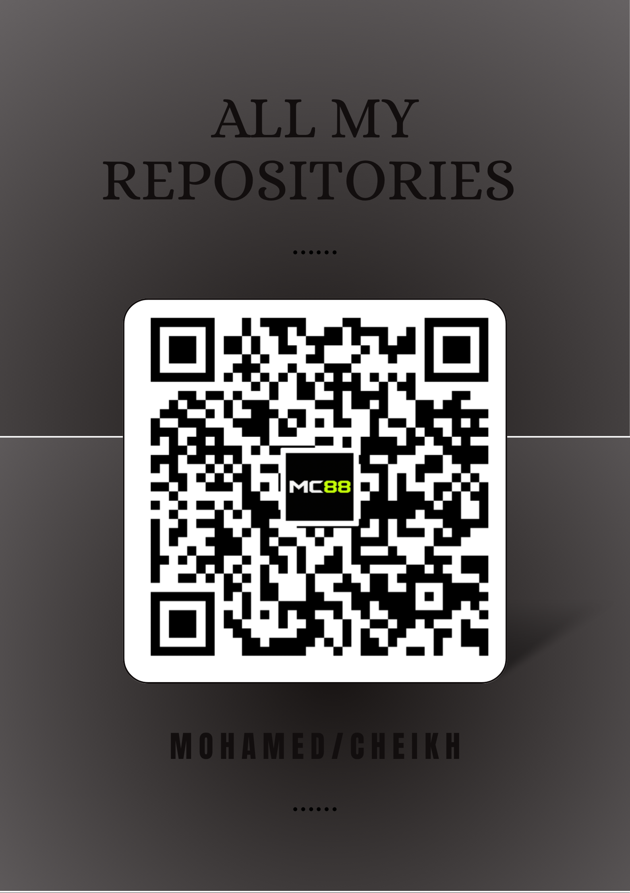

# Mohamed Cheikh

**Computer Science student · Mauritania**

---

I'm Mohamed Cheikh — MC88 on most platforms.

I study computer science in Mauritania. Outside coursework, I design and build web applications. Most of them are single files, most of them are client-side, all of them are things I wanted to exist and made myself.

I work alone, at my own pace, on projects I can see through to the end. That constraint has shaped everything about how I build.

---

## How I work

**Client-side first.**
If a problem can be solved in the browser, it should be. No accounts, no servers I don't control, no third-party services between you and your data. Whatever you put into a tool stays on your device.

**No tracking. No exceptions.**
No analytics, no fingerprinting, no "we use cookies to improve your experience." I don't want to know who uses the tools I publish, and I've made sure the tools don't either.

**Open by default.**
Everything I release is licensed for reuse. Read the source, learn from it, take it apart, build on it. Learning in public only matters if the public can actually read.

**Small over large.**
A tool that solves one problem well beats one that solves ten poorly. I keep my scope tight and my standards high.

**No promises I can't keep.**
Some of what I publish is finished. Some is in progress. Some is a technical experiment I wanted to understand and may never return to. I don't dress any of it up.

---

## A note on the activity chart

Anyone who looks at my contribution graph will see long stretches of quiet, followed by bursts of twenty or thirty repositories appearing on the same day. That's not dormancy. That's the shape of how I work.

I build throughout the year, but I don't push to GitHub while I'm building. I keep the project in a folder on my laptop, test it, refine it, sometimes leave it for a week and come back with fresh eyes. I only publish when the work is finished — or when I've decided it won't be finished and I'm ready to let it go as it is.

The reason is simple. I don't like a commit history that reads like a diary. I want the repository to feel like a completed object, not a record of every wrong turn I took along the way. So the code arrives whole.

The publishing itself happens in batches. Most often at the end of the summer break, when the semester is over and I have a set of finished projects lined up, and I take an evening to send them all out together.

So the graph is honest, in its own way. It just measures the delivery, not the work.

---

## Work

I take on selected freelance projects — most often for small businesses and individuals in Mauritania and the wider region. If you're working on something that needs a careful, self-contained web application, I'd like to hear about it.

I'm also open to internships and collaborations where the problem itself is worth the time.

---

## Contact

**Email** — [mohamed005cheikh@gmail.com](mailto:mohamed005cheikh@gmail.com)  
**WhatsApp** — [+222 30 72 64 75](https://wa.me/22230726475)

The complete list of what I've built is below.

Scan to open the full repository list.

 

© 2026 — Mohamed Cheikh

